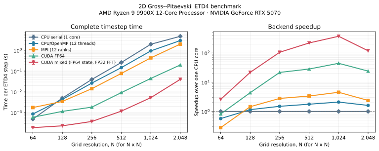

# 2D Gross–Pitaevskii pseudo-spectral solver

A C++20 solver for a complex Gross–Pitaevskii field on a doubly periodic
domain. A shared numerical model is available through OpenMP, hybrid
MPI/OpenMP, and CUDA backends.

Current release: `v0.5.0` (2026-10-08).

Five executables share one model, parameter format, set of time integrators,
and output format:

| Executable | Backend | Use case |
| --- | --- | --- |
| `gross_pitaevskii_cpu_serial` | Serial FFTW | Single-core reference and benchmarking |
| `gross_pitaevskii_cpu` | FFTW, with optional OpenMP | Shared-memory runs |
| `gross_pitaevskii_mpi` | FFTW-MPI, with optional OpenMP | Distributed-memory runs |
| `gross_pitaevskii_cuda` | FP64 CUDA and cuFFT | Full-double NVIDIA GPU runs |
| `gross_pitaevskii_cuda_mixed` | FP64 state/integration, FP32 FFT path | Faster NVIDIA GPU runs when mixed precision is acceptable |

When HDF5 is available, `gp2d_hdf5_export` converts field snapshots back to
solver text fields or directly plottable gnuplot tables.

The solver provides dealiased pseudo-spectral nonlinear evaluation, four
fixed-step exponential or integrating-factor schemes, reproducible stochastic
forcing, atomic checkpoints, automatic restart, and cross-backend regression
tests.

## Equation, forcing, and dissipation

The solver evolves a complex field $\psi(\boldsymbol{x},t)$ on the doubly
periodic domain $L_x=2\pi A_r$, $L_y=2\pi$, where $A_r$ is
`aspectRatio`. Its complete Fourier-space equation is

```math
\partial_t\widehat{\psi}_{\boldsymbol{k}}
=\frac{
  \left(-c\lvert\boldsymbol{k}\rvert^2+\mu\right)
  \widehat{\psi}_{\boldsymbol{k}}
  +g\,\widehat{|\psi|^2\psi}_{\boldsymbol{k}}
}{i-\Gamma_{\boldsymbol{k}}}
-D_{\boldsymbol{k}}\widehat{\psi}_{\boldsymbol{k}}
+F_{\boldsymbol{k}}(t).
```

With Ginzburg–Landau damping, spectral damping, and forcing disabled, this is
the standard Gross–Pitaevskii/nonlinear Schrödinger equation

```math
i\,\partial_t\psi
=c\,\Delta\psi+g|\psi|^2\psi+\mu\psi.
```

The corresponding conserved wave action and Hamiltonian are

```math
\mathcal{N}=\int_\Omega\lvert\psi\rvert^2\,d^2x,
\qquad
H=\int_\Omega\left[-c\lvert\nabla\psi\rvert^2
+\mu\lvert\psi\rvert^2+\frac{g}{2}\lvert\psi\rvert^4\right]d^2x.
```

The optional Ginzburg–Landau factor is

```math
\Gamma_{\boldsymbol{k}}
=\Gamma\,\mathbf{1}_{\{\lvert\boldsymbol{k}\rvert>k_\Gamma\}},
```

where $\Gamma$ and $k_\Gamma$ are `ginzburgLandauDamping` and
`ginzburgLandauCutoff`. The separately applied spectral damping rate is

```math
D_{\boldsymbol{k}}
=\nu\lvert\boldsymbol{k}\rvert^{2p}\,C_\nu(\boldsymbol{k})
+\alpha\lvert\boldsymbol{k}\rvert^{2q}\,C_\alpha(\boldsymbol{k}),
```

where $(\nu,p)$ are `hyperviscosity` and `hyperviscosityOrder`, while
$(\alpha,q)$ are `hypoviscosity` and `hypoviscosityOrder`. By default the
cutoff factors $C_\nu=C_\alpha=1$. If the corresponding cutoff flag is
enabled,

```math
C_\nu=\mathbf{1}_{\{\lvert\boldsymbol{k}\rvert>k_\nu\}},
\qquad
C_\alpha=\mathbf{1}_{\{\lvert\boldsymbol{k}\rvert<k_\alpha\}},
```

with `hyperviscosityCutoff` $=k_\nu$ and `hypoviscosityCutoff`
$=k_\alpha$. For a negative $q$, the singular zero mode is explicitly
suppressed.

### Forcing profiles

For every stochastic profile the forcing term means

```math
d\widehat{\psi}_{\boldsymbol{k}}\big\rvert_{\mathrm{force}}
=f(\lvert\boldsymbol{k}\rvert)\,dW_{\boldsymbol{k}},
\qquad
\mathbb{E}[dW_{\boldsymbol{k}}]=0,
\qquad
\mathbb{E}[dW_{\boldsymbol{k}}dW_{\boldsymbol{k}'}^*]
=\delta_{\boldsymbol{k}\boldsymbol{k}'}\,dt,
```

with independent circular complex Wiener processes. The selectable envelopes
are

```math
\begin{aligned}
f_{\mathrm{annulus}}(k)
  &=A\,\mathbf{1}_{\{\lvert k-k_f\rvert<\Delta k\}},\\
f_{\mathrm{gaussian}}(k)
  &=A\exp\!\left[-\frac12\left(\frac{k-k_f}{\sigma_f}\right)^2\right],\\
f_{\mathrm{exponential}}(k)
  &=A\left(\frac{k}{k_f}\right)^s
    \exp\!\left[-\left(\frac{k}{k_f}\right)^s\right],\\
f_{\mathrm{logNormal}}(k)
  &=A\exp\!\left[-\frac12
    \left(\frac{\log(k/k_f)}{\sigma_{\log}}\right)^2\right].
\end{aligned}
```

The parameters $A,k_f,\Delta k=\sigma_f,s,\sigma_{\log}$ are
`forcingAmplitude`, `forcingWavenumber`, `forcingWidth`,
`forcingShapeOrder`, and `forcingLogWidth`. A positive
`targetWaveActionInjectionRate` rescales the stochastic amplitudes.
`singleMode` is instead deterministic: it applies amplitude $A$ at the four
Fourier-index pairs $(m_x,m_y)=(\pm m,\pm m)$, with
$m=\texttt{forcingWavenumber}$.

### Parameter-symbol map and discretization

| Symbol | Parameter key | Meaning |
| --- | --- | --- |
| $N_x,N_y$ | `nx`, `ny` | Physical-grid dimensions |
| $A_r$ | `aspectRatio` | Domain aspect ratio $L_x/L_y$ |
| $\Delta t$ | `timeStep` | Fixed timestep |
| $c,g,\mu$ | `dispersionCoefficient`, `nonlinearityCoefficient`, `chemicalPotential` | Conservative equation coefficients |
| $\Gamma,k_\Gamma$ | `ginzburgLandauDamping`, `ginzburgLandauCutoff` | Ginzburg–Landau damping and onset |
| $\nu,p,k_\nu$ | `hyperviscosity`, `hyperviscosityOrder`, `hyperviscosityCutoff` | Small-scale damping |
| $\alpha,q,k_\alpha$ | `hypoviscosity`, `hypoviscosityOrder`, `hypoviscosityCutoff` | Large-scale damping |

The cubic term uses a two-pass 3/2-rule treatment:
`psi` is embedded on the padded grid, `psi^2` is transformed and truncated to
the retained band, and that filtered product is multiplied by `conj(psi)`
before the final transform. This is important for a cubic nonlinearity and
provides a momentum-conserving discretization.

Fixed-step integrators are ETDRK2 (`etd2`), ETDRK3 (`etd3`), ETDRK4-B
(`etd4`), and second-order integrating-factor Runge–Kutta (`rk2`). The full
linear operator is integrated analytically. Stochastic forcing uses the exact
linear covariance over one step, and its generator state is checkpointed.

## Requirements

The CPU build requires CMake 3.20+, a C++20 compiler, and FFTW3 development
headers and libraries. OpenMP and FFTW's threads library are optional. The
hybrid executable also needs MPI and FFTW-MPI. The CUDA executables need the
NVIDIA CUDA Toolkit and cuFFT, plus an NVIDIA GPU at run time. Python 3 enables
the end-to-end regression tests. HDF5 is optional and enables compressed field
snapshots, HDF5 initial conditions, and the `gp2d_hdf5_export` utility.

For example, the required packages can be installed on Arch Linux with:

```bash
sudo pacman -S cmake gcc fftw hdf5 openmpi fftw-openmpi cuda python
```

## Build and test

Start with a portable CPU build:

```bash
cmake -S . -B build/cpu -DCMAKE_BUILD_TYPE=Release \
  -DGP2D_MPI=OFF -DGP2D_CUDA=OFF
cmake --build build/cpu -j
ctest --test-dir build/cpu --output-on-failure
```

To build every backend supported by the local toolchain and enable the MPI and
CUDA regression tests:

```bash
cmake -S . -B build/release -DCMAKE_BUILD_TYPE=Release \
  -DGP2D_BACKEND_TESTS=ON
cmake --build build/release -j
ctest --test-dir build/release --output-on-failure
```

CMake omits MPI if MPI or FFTW-MPI is unavailable and omits the CUDA executables if no CUDA
compiler is found. Useful options are:

```text
-DGP2D_OPENMP=OFF
-DGP2D_MPI=OFF
-DGP2D_CUDA=OFF
-DGP2D_HDF5=OFF
-DGP2D_CUDA_ARCHITECTURES=<CUDA architecture>
-DGP2D_BACKEND_TESTS=ON
```

Backend tests are opt-in because they require a working MPI launcher and, for
CUDA, a visible GPU. Convenience targets are `make cpu`, `make mpi`, `make cpu-serial`,
`make cuda`, `make cuda-mixed`, `make benchmark-backends`, and `make test`; set `BUILD_DIR`
if desired.

## Performance benchmark

This benchmark measures complete ETD4-B timesteps on square grids. Each timestep evaluates the
cubic term four times; each evaluation performs four complex transforms on a 3/2-padded grid.
Lower time is better. Points are medians of three calibrated trials, with error bars spanning the
observed minimum and maximum. The speedup panel uses one serial CPU core as its 1.0 baseline.



These results were measured on an AMD Ryzen 9 9900X and NVIDIA GeForce RTX 5070 using one serial
CPU core, 12 OpenMP threads, 12 single-threaded MPI ranks, or one GPU:

| Grid | CPU serial | CPU/OpenMP | MPI | CUDA FP64 | CUDA mixed |
| ---: | ---: | ---: | ---: | ---: | ---: |
| 256 x 256 | 39.66 ms | 26.48 ms | 14.26 ms | 1.839 ms | 0.3767 ms |
| 512 x 512 | 259.4 ms | 146.8 ms | 77.12 ms | 9.208 ms | 1.183 ms |
| 1,024 x 1,024 | 1.955 s | 935.7 ms | 432.4 ms | 44.24 ms | 5.267 ms |
| 2,048 x 2,048 | 4.720 s | 2.938 s | 1.984 s | 197.2 ms | 39.93 ms |

At 2,048 x 2,048, OpenMP, MPI, FP64 CUDA, and mixed CUDA are respectively 1.61x, 2.38x, 23.9x,
and 118x faster than one CPU core. Mixed CUDA is 73.6x faster than CPU/OpenMP, 49.7x faster than
MPI, and 4.94x faster than FP64 CUDA. MPI outperforms OpenMP on this single socket for this
transform-heavy cubic evaluation, although both use the same physical cores. These results are
specific to this machine and implementation.

The timed region begins after runtime startup, FFT planning, allocation, coefficient/state upload,
and warm-up. The 64 through 1,024 grids use two warm-up steps and calibrated trials lasting about
0.75 seconds; the separately collected 2,048 grid uses one warm-up step because one CPU timestep
already takes several seconds. Synchronization is included at both timing boundaries; diagnostics,
file output, and final GPU download are excluded. Thus the figure measures sustained timestep
throughput rather than short-job launch latency. Raw trials, metadata, and reproduction scripts are
in [`benchmarks/`](benchmarks/).

The mixed backend retains the spectral state, ETD stages and coefficients, forcing, stochastic
increments, and extracted nonlinear result in FP64. Only the padded FFT fields and pointwise cubic
products use FP32. It supports the same rectangular geometries, integrators, forcing profiles,
damping, output, and restart path as full CUDA. Across those configurations plus a 64-step
rectangular ETD4 case, the largest observed relative difference from the CPU FP64 reference was
4.68e-10. Long chaotic trajectories should not be expected to remain identical to full FP64; use
`gross_pitaevskii_cuda` when full-double nonlinear evaluation is required.

## Quick start

[`examples/quickstart.params`](examples/quickstart.params) is a small,
repeatable forced run:

```bash
./build/cpu/gross_pitaevskii_cpu examples/quickstart.params
```

It writes snapshots and checkpoints under `data/quickstart/` and CSV
diagnostics under `output/quickstart/`. Remove those directories or change the
paths before starting a fresh run.

All executables accept an optional parameter-file path and otherwise read
`params.txt`:

```bash
./build/release/gross_pitaevskii_cpu run.params

mpirun -n 2 ./build/release/gross_pitaevskii_mpi run.params

./build/release/gross_pitaevskii_cuda run.params

./build/release/gross_pitaevskii_cuda_mixed run.params
```

`threadCount` selects OpenMP and threaded-FFTW threads per process; zero uses
the OpenMP runtime default, including `OMP_NUM_THREADS` when it is set. For
MPI, plan for `ranks * threadCount` CPU cores. Spectral state and ETD stage
fields remain slab-distributed; full fields are gathered to rank zero only at
output frames. Only rank zero writes files.
CUDA keeps time-integration stages and nonlinear FFTs on the device; host
transfers occur for output. Stochastic increments retain the shared host RNG
sequence but upload only forced-mode values before being scattered on the
device. Set `GP2D_CUDA_PROFILE=1` to report average GPU step and noise
preparation times. `GP2D_CUDA_FULL_NOISE=1` restores the full-field transfer
for performance comparisons. Set `cudaGraphEnabled true` to capture and replay
the fixed GPU timestep as a CUDA graph. This is most useful for long production
runs, where its one-time setup cost is amortized over many steps. Large FFTs may
limit the speedup, so compare elapsed time between representative output frames;
leave it disabled when inspecting individual kernel launches.

## Parameter files

Each nonempty line is `key value` or `key = value`; `#` begins a comment. Keys
are case-sensitive, and invalid keys, values, or extra fields stop the run.

| Key | Purpose |
| --- | --- |
| `nx`, `ny` | Even physical-grid dimensions, each at least four |
| `aspectRatio` | Positive `Lx/(2*pi)` |
| `timeStep`, `numberOfSteps` | Fixed step and additional steps this invocation |
| `outputIntervalSteps` | Save cadence; the final step is always saved |
| `integrator` | `etd2`, `etd3`, `etd4`, or `rk2` |
| `dispersionCoefficient` | `c` in the equation |
| `nonlinearityCoefficient` | Cubic coefficient `g` |
| `chemicalPotential` | Linear coefficient `mu` |
| `hyperviscosity`, `hyperviscosityOrder` | `nu` and positive-scale spectral power `p` |
| `hyperviscosityCutoffEnabled`, `hyperviscosityCutoff` | Apply hyperviscosity only above the cutoff |
| `hypoviscosity`, `hypoviscosityOrder` | `alpha` and spectral power `q` (negative is allowed) |
| `hypoviscosityCutoffEnabled`, `hypoviscosityCutoff` | Apply hypoviscosity only below the cutoff |
| `ginzburgLandauDamping`, `ginzburgLandauCutoff` | `Gamma_k` strength and lower wavenumber threshold |
| `forcingEnabled` | Enable or disable forcing |
| `forcingProfile` | `annulus`, `gaussian`, `exponential`, `logNormal`, or `singleMode` |
| `forcingWavenumber` | Profile center; an integer Fourier-mode index for `singleMode` |
| `forcingWidth` | Annulus half-width or Gaussian standard deviation |
| `forcingAmplitude` | Spectral forcing amplitude |
| `forcingShapeOrder` | Exponent for `exponential` forcing |
| `forcingLogWidth` | Log-space sigma for `logNormal` forcing |
| `targetWaveActionInjectionRate` | Normalize stochastic forcing when positive |
| `randomSeed` | Reproducible 64-bit seed; zero chooses and records a time-based seed |
| `writeModeDiagnostics` | Write selected complex Fourier modes |
| `writeVortexDiagnostics` | Write winding counts and sub-cell vortex positions |
| `fieldOutputFormat` | Physical snapshots: `text`, `hdf5`, or `both` |
| `hdf5CompressionLevel` | Deflate level from 0 (off) through 9 |
| `fftwPlanning` | FFTW planner: `estimate`, `measure`, or `patient` |
| `fftwWisdomFile` | Optional FFTW wisdom file to import and update |
| `cudaGraphEnabled` | Capture/replay the CUDA timestep (CUDA backends only) |
| `threadCount` | Host threads per process; zero uses the runtime default |
| `overwriteOutput` | Permit frame replacement; it does not disable restart detection |
| `initialConditionFile` | Optional physical complex field |
| `dataDirectory`, `outputDirectory` | State and diagnostic locations |

Booleans accept `true`/`false` or `1`/`0`. `singleMode` is deterministic at
the four modes with `|kx index| = |ky index| = forcingWavenumber`; the other
profiles use circular complex Gaussian, white-in-time forcing.
Forcing-specific numeric constraints are checked only when `forcingEnabled` is
true; disabled forcing parameters are parsed but otherwise ignored.
`measure` and `patient` spend more time planning but can improve repeated FFT
performance; `fftwWisdomFile` persists those plans and MPI broadcasts/gathers
wisdom across ranks.
For negative `hypoviscosityOrder`, the hypoviscous multiplier is singular at
`k=0`. The mean mode is therefore explicitly set to zero on initialization and
after every time step.

An initial-condition file may be either an HDF5 snapshot or contain `2*nx*ny`
whitespace-delimited numbers ordered as row-major `real imag` pairs. Both
`wavefunction_NNNNNNNN.dat` and `.h5` snapshots can be used directly as an
initial condition. Relative paths are resolved from the directory in which the
executable is launched.

## Output and restart

Fresh runs save frame zero, then the requested cadence and final step.

| Location | Contents |
| --- | --- |
| `dataDirectory/wavefunction_NNNNNNNN.dat` | Physical `real imag` pairs (`ny` by `2*nx`) |
| `dataDirectory/wavefunction_NNNNNNNN.h5` | Optional physical `[ny,nx,2]` double dataset and metadata |
| `dataDirectory/checkpoint_NNNNNNNN.bin` | Normalized complex spectral state |
| `dataDirectory/restart_state.txt` | Latest time, frame, grid identity, and RNG state |
| `outputDirectory/diagnostics.csv` | Hamiltonian components, wave action, and damping rates |
| `outputDirectory/vortices.csv` | Optional positive/negative phase-winding counts |
| `outputDirectory/vortex_positions.csv` | Optional charge and sub-cell position of every detected vortex |
| `outputDirectory/spectra.csv` | Wave-action and quadratic-energy shell spectra |
| `outputDirectory/fluxes.csv` | Wave-action and full Hamiltonian-energy fluxes |
| `outputDirectory/modes.csv` | Optional selected complex Fourier modes |
| `outputDirectory/forcing_*.csv` | Forcing summary and spectrum |
| `outputDirectory/segments/` | Per-invocation resolved parameters and forcing records |

HDF5 snapshots are written atomically as one file per output frame. The
`/wavefunction` dataset stores real and imaginary components in its last
dimension; grid dimensions, physical lengths, time, and frame are attributes.
For production runs, `fieldOutputFormat hdf5` avoids the larger text snapshots;
`both` is convenient while checking an analysis workflow.

Convert an HDF5 frame back to a solver-compatible field or to a table that
gnuplot can read directly:

```bash
./build/release/gp2d_hdf5_export wavefunction_00000010.h5 frame.dat
./build/release/gp2d_hdf5_export wavefunction_00000010.h5 frame.gnuplot \
  --format gnuplot
gnuplot -e "plot 'frame.gnuplot' using 1:2:5 with image"
```

The gnuplot table columns are `x y real imag density phase`. CSV diagnostics
remain unchanged and can still be plotted directly.

Vortex positions are obtained from phase winding around each periodic grid
plaquette, followed by a bilinear solve for the zero of the complex field
inside that plaquette. `core_residual` records the magnitude left at the
estimated zero and is useful for filtering poorly resolved cores. The
`index` is local to one frame; persistent trajectory IDs are not yet assigned.
The first six columns use the existing PointVortex trajectory schema
(`time,frame,index,x,y,circulation`), so `vortex_positions.csv` can be passed
directly to the vortex-imprint tooling with `--frame`.

Here `quadratic_energy` means the kinetic-plus-chemical-potential part,
`area * sum_k (-c*|k|^2 + mu)*|psi_k|^2`. The diagnostics keep its kinetic
and potential components in separate columns; total energy additionally
includes the quartic nonlinear contribution. For consistency with the
two-pass de-aliased cubic term, quartic energy is evaluated from the retained
spectrum of `psi^2`. The energy flux includes both the quadratic and quartic
transfers and uses the legacy low-wavenumber cumulative convention. The
`total_energy_dissipation_hypo` and
`total_energy_dissipation_hyper` columns include each operator's effect on
both the quadratic and quartic Hamiltonian energy; the similarly named
`quadratic_energy_*` columns retain the quadratic-only values. The
`expected_full_energy_injection` column is the instantaneous expected forcing
rate for the full Hamiltonian, including the state-dependent quartic Ito
contribution for stochastic forcing.

When `restart_state.txt` exists, the solver resumes automatically.
`numberOfSteps` means additional steps, CSV files append, and frame numbering
continues. Matching `nx`, `ny`, and `aspectRatio` are required; physical
parameters may change between invocations. Output frames are journaled and
committed atomically, so a partially written frame is rolled back on restart.
Launch the replacement executable from the same working directory, or change
`dataDirectory` and `outputDirectory` to absolute paths, so relative paths still
refer to the original run.
Use new data and output directories for an independent run. Existing restart
metadata always resumes that run; `overwriteOutput` only permits replacement
of colliding output files.

## Point-vortex initial conditions

The [`initial_conditions/`](initial_conditions/) directory provides a modern
bridge from the current
[`2dPointVortex`](https://github.com/jplaurie/2dPointVortex) output formats.
`gp2d_vortex_imprint` converts a generated PointVortex initial-condition file
or a `trajectory.csv` frame into a doubly periodic GP wavefunction with
accurate Padé vortex cores.
`gp2d_relax` then performs CPU imaginary-time relaxation, optionally in a
uniformly moving frame for vortex dipoles. It reuses this solver's production
FFTW/OpenMP nonlinear backend and writes a field that can be passed directly
as `initialConditionFile`. See the
[`initial-condition guide`](initial_conditions/README.md) for equations,
examples, drift conventions, and commands.

## Plotting and movies

The [`scripts/`](scripts/) directory contains Jupyter notebooks for physical
wavefunction maps, spectra, fluxes, and time diagnostics, plus command-line
movie generators for the same data.  The notebooks support individual frames,
multiple frames, and frame averages and write publication-ready PDF figures
using Matplotlib and LaTeX.  Movie output can use H.264 or H.265/HEVC through
ffmpeg.  See [`scripts/README.md`](scripts/README.md) for configuration and
examples.

## Code structure

```text
src/
  main.cpp                    shared executable entry point
  benchmark.cpp               warmed-up complete-timestep benchmark entry point
  parameters.cpp/.hpp         parse, validate, and record settings
  spectral.cpp/.hpp           Fourier indexing and retained-band rules
  fftw_utils.cpp/.hpp         base-grid complex FFTW transforms
  solver.cpp/.hpp             linear operator, forcing, and time stepping
  host_stepper.hpp            shared host ETD/RK timestep orchestration
  integrator.hpp              shared CPU/CUDA stage formulas
  diagnostics.cpp             energies, spectra, fluxes, and forcing records
  vortex_diagnostics.cpp      phase winding and sub-cell vortex positions
  hdf5_io.cpp/.hpp            optional HDF5 field reader/writer
  hdf5_export.cpp             HDF5-to-field/gnuplot conversion utility
  output.cpp/.hpp             snapshots, checkpoints, and restart loading
  output_transaction.cpp      atomic output recovery and run history
  backend.hpp                 common nonlinear-backend interface
  backend_cpu.cpp             FFTW/OpenMP cubic backend
  backend_mpi.cpp             FFTW-MPI/OpenMP cubic backend
  backend_cuda.cu             FP64 and mixed CUDA/cuFFT device backends
benchmarks/
  run_benchmarks.py           calibrated multi-backend benchmark runner
  plot_benchmarks.py          README plot generator
  results*.csv, system*.json  raw trials and machine/build metadata
initial_conditions/
  vortex_imprint.cpp          periodic point-vortex to GP-field command
  imaginary_time.cpp          CPU comoving imaginary-time relaxation
  vortex_field.cpp/.hpp       input parsing, periodic phase, Padé core profile
tests/
  parameters.cpp              parameter parsing and validation tests
  numerics.cpp                direct-DFT nonlinear verification
  runtime_guards.cpp          transaction ordering and workspace reuse tests
  initial_conditions.cpp      periodic-phase and core-profile tests
  regression.py               restart and cross-backend comparisons
  convergence.py              exact-solution temporal-order checks
  hdf5_output.py              HDF5 round-trip and exporter tests
```

Configuration text is converted at the input boundary into typed `Integrator`
and `ForcingProfile` values. Parsing, assignment, and cross-parameter
validation are separate steps, so the numerical code never interprets raw
configuration strings.

The `Solver` owns the shared run state and delegates the dealiased cubic term—and,
for CUDA, device-resident time stepping—to the selected backend. Named ETD
stages make the CPU and CUDA implementations follow the same sequence, while
run preparation, restart restoration, diagnostics, and state output remain
focused operations.

## Version history

These versions were assigned retrospectively to the main development milestones;
the dates below are the dates of the tagged commits.

| Version | Date | Changes |
| --- | --- | --- |
| `v0.5.0` | 2026-10-08 | Unified backend time stepping, distributed MPI state, FFTW planning/wisdom, CUDA graphs, convergence and CI coverage, HDF5 field I/O/export, periodic 2D vortex detection, and defensive provenance, exporter, transaction, and workspace checks. |
| `v0.4.0` | 2026-10-04 | Added the mixed-precision CUDA path, reproducible multi-backend benchmarks, performance plots and mixed/full-precision regression coverage. |
| `v0.3.0` | 2026-09-30 | Added vortex-imprinted initial-condition generation and comoving imaginary-time relaxation, with tests and examples; reorganized the solver for readability. |
| `v0.2.0` | 2026-09-16 | Reduced CUDA transfers for stochastic forcing and added reusable plotting, diagnostic-notebook and movie tools. |
| `v0.1.1` | 2026-09-08 | Corrected the dissipation implementation and expanded numerical regression checks. |
| `v0.1.0` | 2026-09-07 | Introduced the modern C++20 codebase with shared CPU/OpenMP, MPI/OpenMP and CUDA implementations, unified builds, validated parameters, restartable output and tests. |

## License and citation

Copyright (c) 2022–2026 Jason Laurie. This project is distributed under the
[BSD 3-Clause License](LICENSE). Third-party dependencies, including FFTW,
remain subject to their own license terms.

If this software contributes to research or a publication, please cite it
using the metadata in [`CITATION.cff`](CITATION.cff).
